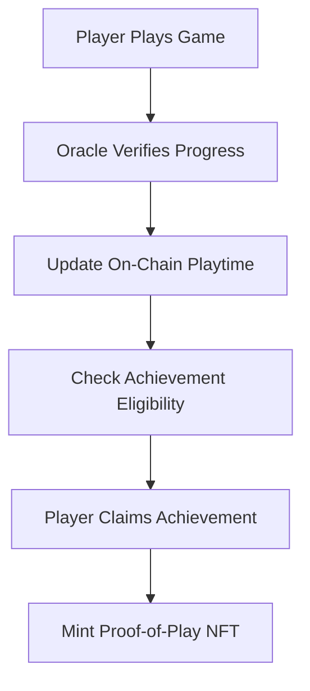

# 🎮 Proof-of-Play NFT Rewards

> Transform gaming dedication into valuable digital assets through blockchain-verified achievements

## 🌟 Overview

Proof-of-Play NFT Rewards is a revolutionary smart contract that bridges the gap between gaming effort and real-world digital ownership. Players earn unique NFTs by proving their dedication, milestones, and achievements in supported games through off-chain oracle verification.

### ✨ Key Features

- 🏆 **Achievement-Based NFTs** - Earn unique tokens for gaming milestones
- 🔍 **Oracle Verification** - Trusted off-chain verification of playtime and achievements  
- 🎯 **Multi-Game Support** - Track progress across multiple supported games
- 💎 **Collectible & Tradeable** - NFTs serve as status symbols and tradeable assets
- 📊 **Progress Tracking** - Comprehensive player statistics and game history
- 🛡️ **Secure & Transparent** - Built on Stacks blockchain with full transparency

## 🚀 Getting Started

### Prerequisites

- [Clarinet CLI](https://docs.hiro.so/stacks/clarinet) installed
- Node.js and npm for testing
- Stacks wallet for interaction

### Installation

```bash
git clone <repository-url>
cd Proof-of-Play-NFT-Rewards
clarinet check
npm install
npm test
```

## 📋 Contract Functions

### 🔐 Admin Functions (Owner Only)

#### Oracle Management
- `add-oracle(oracle-address: principal)` - Add trusted oracle for game verification
- `remove-oracle(oracle-address: principal)` - Remove oracle access

#### Game Management  
- `add-game(name: string-ascii, required-playtime: uint)` - Register new supported game
- `toggle-game-status(game-id: uint)` - Enable/disable game tracking

#### Achievement Management
- `add-achievement(name, description, game-id, playtime-requirement)` - Create new achievement
- `toggle-achievement-status(achievement-id: uint)` - Enable/disable achievement

### 🎮 Player Functions

#### Core Gameplay
- `claim-achievement(achievement-id: uint)` - Mint NFT for completed achievement
- `transfer(token-id, sender, recipient)` - Transfer NFT ownership
- `burn(token-id: uint)` - Burn owned NFT

### 🤖 Oracle Functions

#### Data Updates
- `update-playtime(player, game-id, playtime-minutes)` - Record verified playtime

### 📖 Read-Only Functions

#### Data Queries
- `get-player-progress(player: principal)` - Get complete player statistics
- `get-player-game-playtime(player, game-id)` - Get playtime for specific game
- `can-claim-achievement(player, achievement-id)` - Check achievement eligibility
- `get-nft-metadata(token-id: uint)` - Get NFT achievement details
- `get-game(game-id: uint)` - Get game information
- `get-achievement(achievement-id: uint)` - Get achievement details

## 🏗️ Architecture

### Core Components

1. **NFT System** 🎨
   - ERC-721 compatible tokens representing achievements
   - Unique metadata linking to specific accomplishments
   - Transferable and burnable digital assets

2. **Oracle Network** 🔮
   - Trusted off-chain verification system
   - Secure playtime and achievement validation
   - Multi-oracle support for decentralization

3. **Achievement Engine** 🏅
   - Flexible achievement creation system
   - Playtime-based progression tracking
   - Game-specific milestone recognition

4. **Progress Tracking** 📈
   - Comprehensive player statistics
   - Multi-game playtime aggregation
   - Achievement history maintenance

### Data Flow



## 🎯 Use Cases

### For Players 👾
- **Digital Bragging Rights** - Show off gaming achievements
- **Cross-Platform Recognition** - Achievements recognized across platforms
- **Monetization** - Trade achievements as valuable NFTs
- **Progress Verification** - Permanent record of gaming dedication

### For Game Developers 🎮
- **Enhanced Engagement** - Reward systems increase player retention
- **Community Building** - Achievement-based social features
- **Analytics** - On-chain player behavior insights
- **Monetization** - Revenue sharing from NFT transactions

### For Collectors 💎
- **Rare Achievements** - Collect difficult-to-obtain gaming NFTs
- **Historical Value** - Early gaming achievements gain value over time
- **Portfolio Diversification** - Gaming assets in crypto portfolio
- **Community Status** - Recognition within gaming communities

## 🔧 Development

### Testing

```bash
npm test
```

### Local Development

```bash
clarinet console
```

### Deployment

```bash
clarinet deploy --testnet
```

## 🛡️ Security Considerations

- **Oracle Trust** - Only verified oracles can update playtime
- **Achievement Integrity** - Strict validation prevents false claims
- **Owner Controls** - Administrative functions restricted to contract owner
- **Data Validation** - All inputs validated before processing

## 🤝 Contributing

1. Fork the repository
2. Create a feature branch
3. Make your changes
4. Add tests for new functionality
5. Submit a pull request

## 📄 License

This project is licensed under the MIT License - see the [LICENSE](LICENSE) file for details.

## 🙏 Acknowledgments

- Stacks blockchain for providing the infrastructure
- Clarinet team for excellent development tools
- Gaming community for inspiration and feedback

## 📞 Support

- **Documentation**: [Clarinet Docs](https://docs.hiro.so/stacks/clarinet)
- **Community**: [Stacks Discord](https://discord.gg/stacks)
- **Issues**: GitHub Issues tab

---

*Transform your gaming journey into lasting digital value with Proof-of-Play NFT Rewards!* 🚀✨
